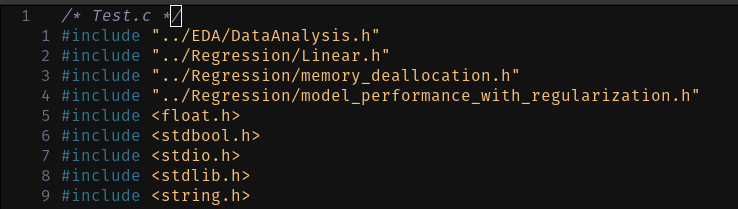

# Simple Linear Regression Library

This project is a lightweight C library designed for simple linear regression. It provides an efficient and flexible way to perform data analysis, enabling users to model relationships between two variables with ease. The library includes functions for data normalization, dataset splitting, and model training, ensuring optimal performance even on systems with limited resources.

### Key Features:
- **Efficiency**: Optimized for high performance, delivering accurate results with minimal computational overhead.
- **Flexibility**: Easily integrates into larger C projects, supporting various dataset formats and workflows.

Perfect for developers seeking a foundational yet robust tool for regression tasks in C.

---

## Table of Contents
1. [Project Structure](#project-structure)  
2. [How to Use?](#how-to-use)  
3. [How to Debug or Trace Memory Allocation Errors?](#how-to-debug-or-trace-memory-allocation-errors)  
4. [File Descriptions](#file-descriptions)  
5. [License](#license)  

---

## Project Structure

```bash
Project Root Directory
|-- build
| `-- test
|-- EDA
|   |-- DataAnalysis.c
|   |-- DataAnalysis.h
|-- Regression
| |-- Linear.c
| |-- Linear.h
|-- Test
| |-- test.c
|-- compile_commands.json
|-- License
|-- makefile
|-- README.md
|-- winequality.names
|-- winequality-red.csv
`-- winequality-white.csv
```

---

## How to use?

1. Include necessary Header files 



---

## How to Debug or Trace Memory Allocation Errors?

Use **GDB** for debugging and **Valgrind** to check for memory issues.

### Debugging with GDB:
```bash
gdb ./build/test
```

Refer to the [official GDB documentation](https://www.gnu.org/software/gdb/documentation/) for more details.

### Memory Leak Detection with Valgrind:
```bash
valgrind --leak-check=full --track-origins=yes -s ./build/test
```

Refer to the [official Valgrind documentation](https://valgrind.org/docs/) for further information.

---

## File Descriptions
- **`build/test`**: The compiled binary file generated after running the `make` command.
- **`EDA/DataAnalysis.c` and `EDA/DataAnalysis.h`**: Source and header files for exploratory data analysis (EDA) utilities.
- **`Regression/Linear.c` and `Regression/Linear.h`**: Source and header files for simple linear regression implementation.
- **`Test/test.c`**: Test file to validate and demonstrate library functionality.
- **`compile_commands.json`**: Compilation database for debugging tools like `clangd` or `VSCode`.
- **`winequality-red.csv` and `winequality-white.csv`**: Example datasets for testing and demonstrating the library.

---

## License

The project is licensed under the **MIT License**. Check the `License` file in the root directory for more details.

---

